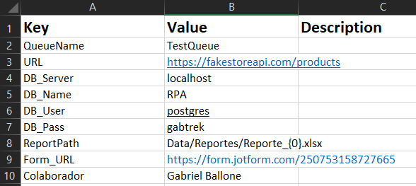

# PIXRPA-PruebaTecnica
Prueba técnica para puesto de Desarrollador RPA con PIX Robotics

- Automatización creada con PIX Studio
### Requesitos funcionaes del proceso
---
🎯 Objetivo General:
Desarrollar un proceso RPA utilizando la plantilla universal de PIX RPA, integrando distintas habilidades técnicas para simular un flujo de trabajo
empresarial completo.
💼 Contexto:
Una empresa ficticia de análisis de comercio electrónico quiere automatizar el proceso de monitoreo de productos en línea, registro en base de datos,
generación de reportes y enviarlo mediante un formulario web interno.

Breve descripción de pasos solicitados:
1. Consumo de API Pública
    - Endpoint: https://fakestoreapi.com/products
    - Guardado JSON en local
2. Inserción en Base de Datos
    - Campos: id, title, price, category, description, fecha_insercion
3. Generación de Reporte
    - Reporte en Excel con listado completo de productos y métricas de resumen:
        - Cantidad total de productos
        - Precio promedio general
        - Precio promedio por categoría
        - Cantidad de productos por categoría 
4. Automatización Web – Subida de Formulario
    - URL: https://form.jotform.com/250753158727665
    
    - Datos de formulario:
        - Nombre colaborador
        - Fecha de reporte
        - Comentarios
        - Adjunto Excel de reporte

### Configuración y ejecución de robot
---
1. Clonar desde GitHub https://github.com/gabrielballone/PIXRPA-PruebaTecnica.git o descargar en carpeta local.
Abrir archivo de proyecto *.pixproj*
2. El archivo *Data/Config.xlsx* contiene las configuraciones básicas necesarias para el correcto funcionamiento:

> [!IMPORTANT]
> El bot fue creado para trabajar con el DBMS PostgreSQL. Ajustar valores según entorno de DB, User, Pass.

3. Ejecutar desde PIX Studio
4. Resultados:
    - En *Data\Input\data.json* el bot guarda un archivo con los datos totales entregados por la API consumida.
    - La carpeta Data\Reportes guarda los Excel de resumen.
    - En *Data\Output* se segenera una captura de pantalla *.png* de la confirmación del envío del formulario web.

### Video demostración
- https://vimeo.com/1075420921/bc1d32df01?ts=0&share=copy